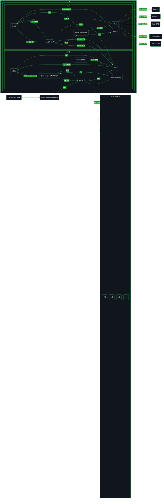
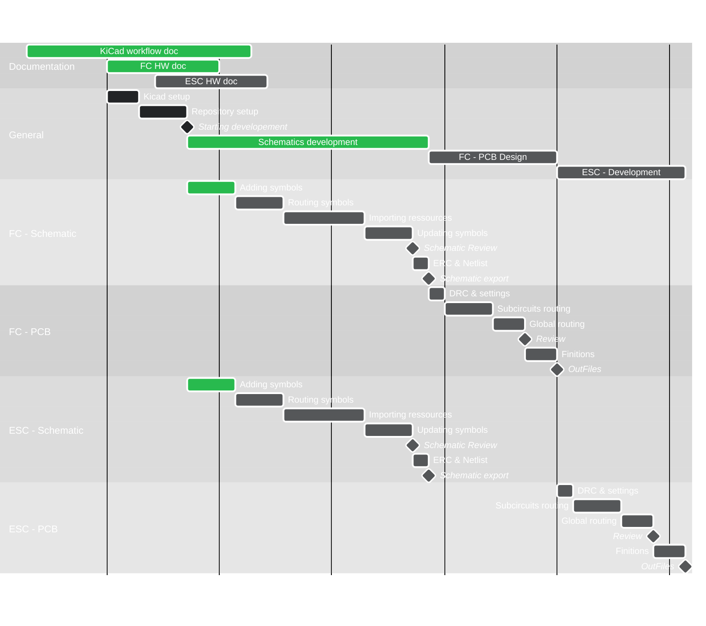
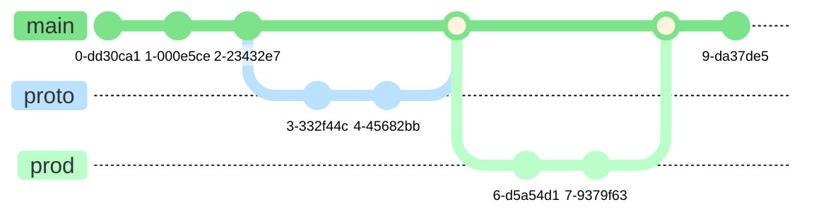

<div align="center">

#  AetherStack

</div>

<div align="center">

[](. "No link")
[](. "No link")
[](./LICENSE "Open repo license file")
[](https://github.com/Lpwlk "Go to GitHub profile page")
[](https://github.com/Lpwlk/AetherStack/tags "Go to GitHub repo tags")
[](https://github.com/Lpwlk/AetherStack "Go to GitHub repo")

</div>

## Table of Contents

1 - [Project description](#1---project-description)  
&nbsp;&nbsp;&nbsp;1.1 - [General informations](#11---general-informations)  
&nbsp;&nbsp;&nbsp;1.2 - [FPV stack description](#12---fpv-stack-description)  
&nbsp;&nbsp;&nbsp;1.3 - [Repository structure](#13---repository-structure)  
&nbsp;&nbsp;&nbsp;1.4 - [Project roadmap](#14---project-roadmap)  
2 - [Flight controller](#2---flight-controller)  
&nbsp;&nbsp;&nbsp;2.1 - [Schematic contents](#21---schematic-contents)  
&nbsp;&nbsp;&nbsp;2.2 - [PCB design notes](#22---pcb-design-notes)  
3 - [ESC](#3---esc)  
&nbsp;&nbsp;&nbsp;3.1 - [Schematic contents](#31---schematic-contents)  
&nbsp;&nbsp;&nbsp;3.2 - [PCB design notes](#32---pcb-design-notes)  
4 - [Documentation](#4---documentation)  
5 - [Contribution](#5---contribution)  
6 - [License](#6---license)  

<div align="center">
    
</div>

## &nbsp;&nbsp; 1 - Project description

### &nbsp;&nbsp;&nbsp;&nbsp; 1.1 - General informations

The original scope of this project is the design of a complete FPV drone stack (details in the [section](#12---fpv-stack-description) below) including all of my personnal [build requirements](#fc---initial-target-specifications).
This repository will be hosting all of the hardware design files (KiCad 8.0.0) associated with my homemade FPV stack. It may also host software integration and BetaFlight target configuration files in the future.

My initial requirements in terms of functionalities and specifications correspond to a classical digital FPV drone powered by 6s LiPo battery packs (~25V) and used as a freestyle & long range drone. I like the idea of being able to simply plug-in peripherals so additionnal JST connectors will be included for ESC board, GoPro Bones power supply, TBS Nano RX and DJI Air Unit.

Here are my target specifications for the first release of my FPV stack boards ...

<samp>

###### FC - Initial target specifications
> - Dimensions: 41x39mm
> - Mounting: 30.5x30.5mm
> - Weight: 12g (board only)
> - Operating temperature: -15°C to 60°C 
> - Input voltage: 15-26V (4-6s)
> - MCU: STM32F722
> - USB port: Type-C
> - Firmware: BetaFlight
> - Firmare target: AETHERF7V0 (BetaFlight)
> - OSD: AT7456E
> - Sensors
>   - IMU: ICM-20689
>   - BARO: BMP280
> - Connectors: 
>   - JST-8 (ESC)
>   - JST-6 (DJI Air Unit)
>   - JST-4 (RX)
>   - JST-3 (GoPro)
> - Blackbox: < 200MB
> - UARTs: 5 available
> - Buzzer: Pins available
> - Leds: Pins available
> - VTX: Analog VTX not supported

</samp>

<samp>

###### ESC - Initial target specifications
> - Dimensions: 45x42mm
> - Mounting: 30.5x30.5mm
> - Weight: 20g (board only)
> - Current rating: 4x 50A
> - Burst: 4x 55A (10s max.)
> - Operating temperature: -15°C to 60°C 
> - Input voltage: 15-26V (4-6s)
> - Firmware: BLheli_32
> - Protocols: DSHOT 300/600
> - Heatsink: No
> - TVS diodes: Yes
> - External capacitor: 1500uF 35V Low ESR

</samp>

> [!WARNING]
These specifications are previsions that I made based on existing modern FPV stack specifications and on personal needs for my FPV builds. They are subject to multiple adjustments during the prototype development process and some features may be added or removed.

### &nbsp;&nbsp;&nbsp;&nbsp; 1.2 - FPV stack description

The following flowchart diagram is a detailed illustration of the electronics involved in this project for anyone who does not know FPV at all. It may also be useful to give it a look even if you aren't new to FPV but still interested in understanding the typical FPV drone hardware architecture. 

<div align="center">


</div>

> [!TIP] What is an FC ?
A <u>*Flight Controller*</u>[^1] is the brain and central part of any drone. An FC PCB includes a powerful microcontroller which is charged to communicate with external peripherals (e.g. Video transmitter, Radio commands receiver, Intertial sensors, ...). The MCU is also responsible for the control of the motors by sending sensors-based regulation (PID regulation[^2]) signals to the ESC using specific protocols (DSHOT[^3] protocol for this project).

> [!TIP] What is an ESC ?
An <u>*Electronic Speed Controller*</u>[^4] is required whenever a system includes a BLDC motor. These PCBs are used to drive BLDC motors phases in order to control & regulate their speed. Modern ESC used in FPV quadcopters are 4-in-1 ESC. It means that the PCB is a part of the stack replacing the PDB and it includes 4 distinct ESC to control all 4 motors instead of one PCB/motor. A 4-in-1 ESC is then receiving 4 DSHOT signals from the FC to drive the motors at their respective speeds.

## &nbsp;&nbsp;&nbsp;&nbsp; 1.3 - Repository structure

The repository includes two directories for each kiCad projects (FC & ESC). Every markdown documentation files referenced in the documentation section [below](#documentation) are located in the directory they are about.

```js
AetherStack
├── AetherFC (kicad project #1)
│   ├── AetherFC.kicad_pro
│   └── [...]
├── AetherESC (kicad project #2)
│   ├── AetherESC.kicad_pro
│   └── [...]
└── Ressources
    ├── Symbols
    ├── Footprints
    └── Stepmodels
```

> [!NOTE]
This structure should be kept as it is presented below, even in the case of future additions of firmware configuration files.

### &nbsp;&nbsp;&nbsp;&nbsp; 1.4 - Project roadmap

Here is a Gantt diagram that will be regularly updated as a project roadmap. This diagram focuses only on FC & ESC prototype boards development period. Another diagram should be created for the first batch version (post-prototypes) development.
        
<div align="center">


</div>

> [!NOTE]
This diagram is supposed to be regularly updated during the associated period. Potential perturbations in this planning will be included in the diagram.


<div align="center">
    
</div>

## &nbsp;&nbsp; 2 - Flight controller

The flight controller design includes support for DJI Air-Units as well as GoPro 10 Bones using 2s to 6s batteries. Schematic contents and FC PCB design informations will be included here. 

### &nbsp;&nbsp;&nbsp;&nbsp; 2.1 - Schematic contents

The FC schematic is separated in 4 kiCad subsheets linked using a root sheet. These subsheets contents will be listed in the following subsections ...

#### &nbsp;&nbsp;&nbsp;&nbsp;&nbsp;&nbsp; 2.1.1 - MCU schematic

#### &nbsp;&nbsp;&nbsp;&nbsp;&nbsp;&nbsp; 2.1.2 - Sensors schematic

#### &nbsp;&nbsp;&nbsp;&nbsp;&nbsp;&nbsp; 2.1.3 - Power conversion schematic

#### &nbsp;&nbsp;&nbsp;&nbsp;&nbsp;&nbsp; 2.1.4 - Connectors schematic

### &nbsp;&nbsp;&nbsp;&nbsp; 2.2 - PCB design notes

>[!NOTE] 
For more informations about the flight controller, please refer to the [documentation](#4---documentation) section or the related development notes which are available in the `AetherFC` directory[^5].

## &nbsp;&nbsp; 3 - ESC

The 4-in-1 ESCs board is designed for LiPo batteries from 2s to 6s and the future compatibilities with recend DShot protocol versions will be updated in the next few weeks. Schematic contents and ESC PCB design informations will be included here. 

### &nbsp;&nbsp;&nbsp;&nbsp; 3.1 - Schematic contents

#### &nbsp;&nbsp;&nbsp;&nbsp;&nbsp;&nbsp; 3.1.1 - MCU schematic

#### &nbsp;&nbsp;&nbsp;&nbsp;&nbsp;&nbsp; 3.1.2 - Motor drive schematic

#### &nbsp;&nbsp;&nbsp;&nbsp;&nbsp;&nbsp; 3.1.3 - Power conversion schematic

#### &nbsp;&nbsp;&nbsp;&nbsp;&nbsp;&nbsp; 3.1.4 - Connectors schematic

### &nbsp;&nbsp;&nbsp;&nbsp; 3.2 - PCB design notes

>[!NOTE] 
For more informations about the electronic speed controllers, please refer to the [documentation](#4---documentation) section or the related development notes which are available in the `AetherESC` directory[^6].

<div align="center">
    
</div>


## &nbsp;&nbsp; 4 - Documentation

This section includes general informations about the stack architecture and features. The project initial target features along with evolutions will be also be documented in this section. Links to project-related makdown documents will be referenced when necessary.

## &nbsp;&nbsp; 5 - License

The project is currently published under MIT license which allows very flexible use for any kind of purposes and contributions. 

> [!CAUTION]
If using content from this drone hardware design project, edited or not, you acknowledge and accept full responsibility for its use. The author disclaims all liability for any damages or consequences resulting from its use in any context.

## &nbsp;&nbsp; 6 - Contribution

Pull requests are welcome. For major changes, please start by opening an issue first to discuss what you would like to change and in which way you would like to to it.

### &nbsp;&nbsp;&nbsp;&nbsp; 6.1 - Contribution guidelines [TODO]

This sections focuses on general contribution guidelines for the KiCad project files only. 

> [!TIP]
To modify any KiCad project libraries from the `Ressources` directory, please ensure you meet the requirements described in the `CONVENTIONS.md` file[^7] for your modifications to be accepted. This ensures that everyone can understand how these ressources are structured and used in the projects.

### &nbsp;&nbsp;&nbsp;&nbsp; 6.2 - Repository gitgraph [TODO]

<div align="center">



</div>

<div align="center">

&nbsp;
 


</div>

<div align="center">

<samp>

###### Mardown file generated using <a href ="https://github.com/Lpwlk/ReadmeEngine">readme-engine</a>

#### [Back to TOP](#table-of-contents)

</samp>

</div>

[^1]: Flight Controllers explained: [https://fusion.engineering](https://fusion.engineering/flight-controllers-explained-for-everyone/)

[^2]: PID regulation Wikipedia page: [https://wikipedia/PID](https://en.wikipedia.org/wiki/proportional-integral-derivative_controller)

[^3]: DSHOT protocol overview: [https://oscarliang.com/dshot/](https://oscarliang.com/dshot/)

[^4]: ESC & BLDC motors explained: [https://howtomechatronics.com](https://howtomechatronics.com/how-it-works/how-brushless-motor-and-esc-work/)

[^5]: AetherFC development notes - [[FC] DEV-NOTES.md](AetherFC/DEV-NOTES.md)

[^6]: AetherESC development notes - [[ESC] DEV-NOTES.md](AetherESC/DEV-NOTES.md)

[^7]: Projects library conventions - [CONVENTIONS.md](Ressources/CONVENTIONS.md)
